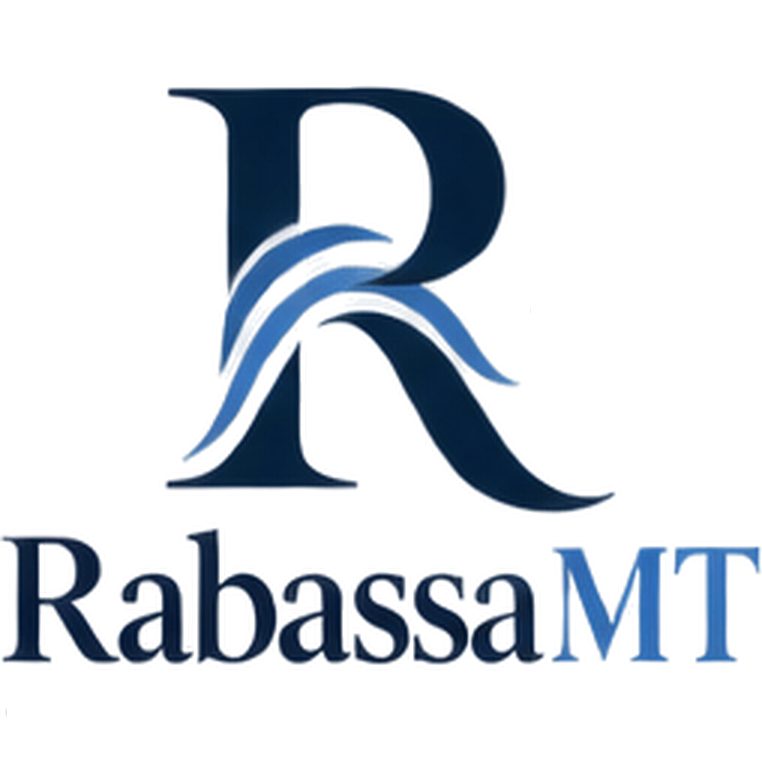

# RabassaMT

**Open-source machine translation with a literary touch.**

Elegant, distinctive, meaningful translation — built in the open.

[Repositories](https://github.com/RabassaMT) · [Discussions](https://github.com/orgs/RabassaMT/discussions)

---

## About

**RabassaMT** is an open-source machine translation project inspired by the craft of literary translation.

The name pays tribute to **Gregory Rabassa**, one of the most influential literary translators of the modern era. His work demonstrated that translation can be more than transferring words between languages: it can preserve voice, rhythm, atmosphere, and meaning across worlds.

RabassaMT explores that same idea in the context of machine translation.

> *“To translate is to carry meaning across worlds.”*  
> — inspired by Gregory Rabassa

## What we care about

- **Meaning over literalism** — translation should preserve intent and context, not merely words.
- **Literary sensitivity** — style, voice, rhythm, and nuance matter.
- **Open source** — research, software, models, and tooling should be accessible and reproducible.
- **Practical engineering** — ideas should become reliable software that people can actually use.
- **Human-readable results** — machine translation should feel natural, not merely technically correct.

## Projects

RabassaMT is intended to become a home for open-source tools and experiments around machine translation, including:

- translation engines and inference tooling
- language and translation models
- evaluation and benchmarking
- translation workflows
- developer libraries and utilities
- research experiments

Individual repositories will define their own status, documentation, and contribution guidelines.

## Contributing

RabassaMT is built in the open.

If you are interested in machine translation, NLP, linguistics, software engineering, evaluation, or literary translation, contributions and thoughtful discussion are welcome.

Please check the relevant repository before contributing, as each project may have its own development guidelines.

## Why Rabassa?

Gregory Rabassa's translations are a reminder that the best translation is not necessarily the most literal one. It is the one that carries the work itself — its meaning, voice, and character — into another language.

That is the spirit behind RabassaMT.

---

**RabassaMT — Open Source Machine Translation**

*Words change. Meaning travels.*

